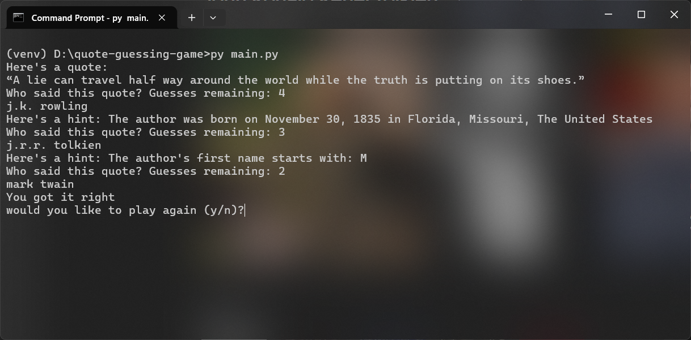

#  Quote Guessing Game (Web Scraping + CLI)

An interactive command-line game built in Python that scrapes real quotes from a website and challenges the user to guess the author with progressive hints.

---

##  Features

* **Live Web Scraping** – Fetches quotes dynamically from a website
* **Randomized Gameplay** – Each round presents a different quote
* **Progressive Hints System**

    * Birth date & location
    * First name initial
    * Last name initial
* **Replay Support** – Play multiple rounds in one run
* **Clean Modular Design** – Separation of scraping and game logic

---

## Project Structure

```
quote-guessing-game/
│
├── main.py        # Entry point
├── scraper.py     # Handles scraping quotes
├── game.py        # Game logic and hint system
├── requirements.txt
└── README.md
```

---

## Tech Stack

* **Python 3**
* **Requests** – HTTP requests
* **BeautifulSoup (bs4)** – HTML parsing

---

## How to Run

1. Clone the repository:

```
git clone https://github.com/nautiyalSumit/quote-guessing-game
cd quote-guessing-game
```

2. Install dependencies:

```
pip install -r requirements.txt
```

3. Run the game:

```
python main.py
```

---

## Example Gameplay
```
<-- 
    Here's a quote:
    “I'm the one that's got to die when it's time for me to die, so let me live my life the way I want to.”

    Who said this quote? Guesses remaining: 4
        > j.k. rowling

    Here's a hint: The author was born on November 27, 1942 in Seattle, Washington, The United States
    Who said this quote? Guesses remaining: 3
        > mark twain

    Here's a hint: The author's first name starts with: J
    Who said this quote? Guesses remaining: 2
        > jane austen

    Here's a hint: The author's last name starts with: H
    Who said this quote? Guesses remaining: 1
        > jimi hendrix

    You got it right
    would you like to play again (y/n)?  --> 
```

## Screenshots



## How It Works

* `scraper.py` crawls multiple pages and collects quotes, authors, and bio links
* `game.py` selects a random quote and manages gameplay logic
* Additional requests are made to fetch author details for hints

---

## Challenges Faced

* Handling pagination while scraping multiple pages
* Extracting structured data from HTML
* Designing a hint system that balances difficulty
* Managing user input and game flow in CLI

---

## Future Improvements

* Add scoring system
* Add difficulty levels
* Cache scraped data to reduce repeated requests
* Add leaderboard / stats

---

## Notes

* This project is intended for learning purposes
* Data is scraped from: https://quotes.toscrape.com

---

## Author

**Sumit Nautiyal**
